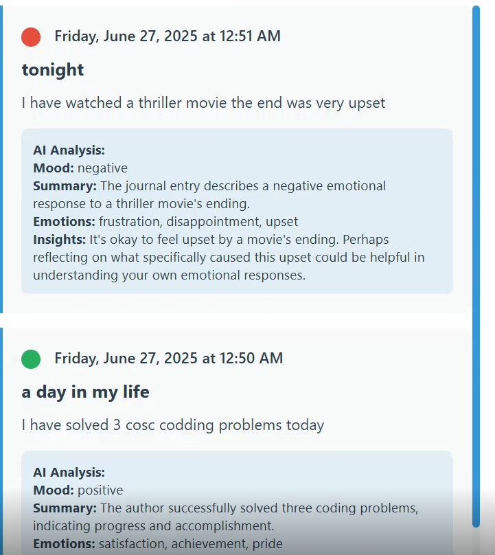

# 🌈 AI-Powered Journaling Web App

A sleek, full-stack journaling web application that allows users to log their daily thoughts and receive real-time AI-generated insights, mood analysis, and emotional feedback. Built with a responsive UI and powered by Google's **Gemini API** for intelligent journaling.

---

## ✨ Key Features

- 🎨 **Modern UI**: Beautiful gradient design, smooth animations, hover effects, and responsive layout
- 📝 **Journal Entry Form**: Write entries with optional titles
- 🤖 **Gemini API Integration**: Analyze entries with real-time AI mood detection and feedback
- 📅 **Timeline View**: Chronological display of entries with visual mood indicators
- 🎭 **Mood Indicators**:
  - 🟢 Green: Positive  
  - 🟡 Yellow: Neutral  
  - 🔴 Red: Negative
- 🚀 **Real-Time Feedback**: Dynamic success/error messages and loading states

---

## 🔧 Technical Stack

- **Frontend**: HTML, CSS, and vanilla JavaScript (ES6+)
- **API Integration**: Gemini (Google AI) API
- **Data Storage**: In-memory (can be extended to localStorage, Firebase, or any backend DB)
- **Design**: Fully responsive for desktop and mobile

---

## 🧠 AI Features

- **Mood Detection**: Classifies journal sentiment as Positive / Neutral / Negative
- **Summary Generation**: Provides a concise summary of each journal entry
- **Emotion Recognition**: Identifies key emotions present in the text
- **Personalized Insights**: Offers motivating and reflective feedback

Open the index.html in your browser.

Start journaling:

Enter your title (optional) and journal entry

Click "Save Entry & Analyze"

View the mood, summary, and insights on the timeline

## screenshot of execution

🙌 Acknowledgements
Google Gemini API

Frontend inspiration from modern journaling UIs
